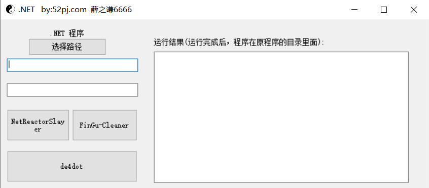

## 介绍

整合一下.Net 脱壳工具

NetReactorSlayer：https://github.com/SychicBoy/NetReactorSlayer

de4dot：https://github.com/de4dot/de4dot

FinGu-Cfex-Cleaner：https://github.com/CursedLand/FinGu-Cfex-Cleaner

exeinfope：https://down.52pojie.cn/Tools/PEtools/ExeinfoPe.zip

## 描述

v 0.0

v 0.1  ：新增一个程序

​		        

v 0.2：增加内置exeinfope查壳工具

​				

由于技术不是很牛批，NetReactorSlayer按钮没弄好！只能手动到cmd里面执行.....

## 后续计划

1. 开源
2. 整合更多的程序

## 使用方法

​	 			

